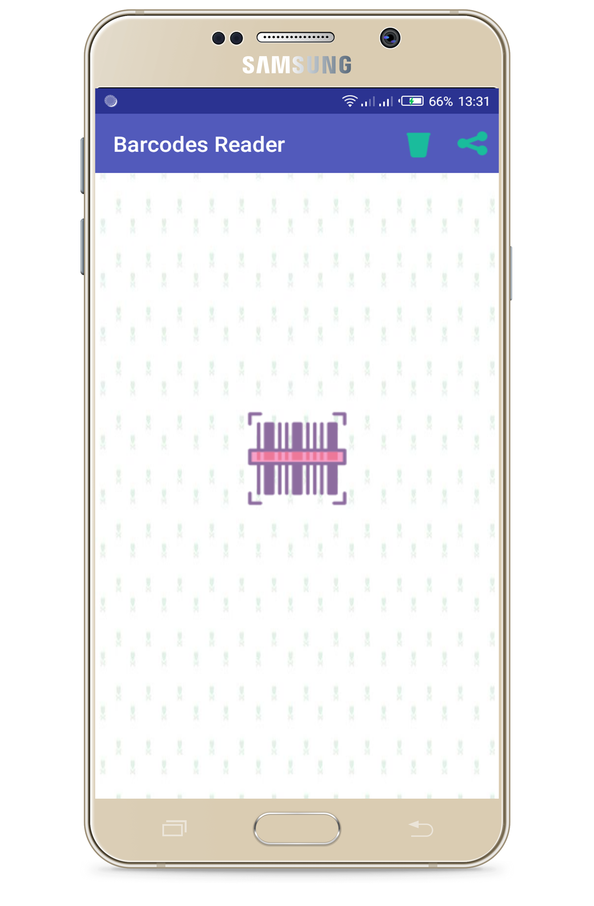
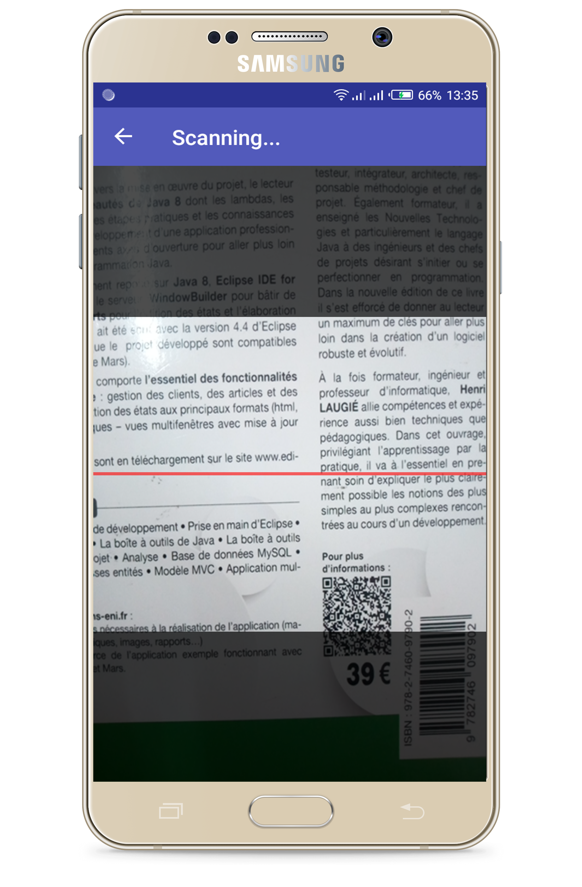
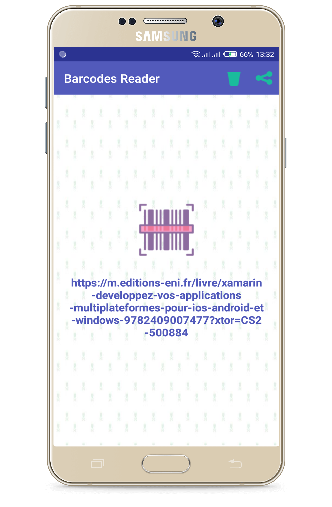
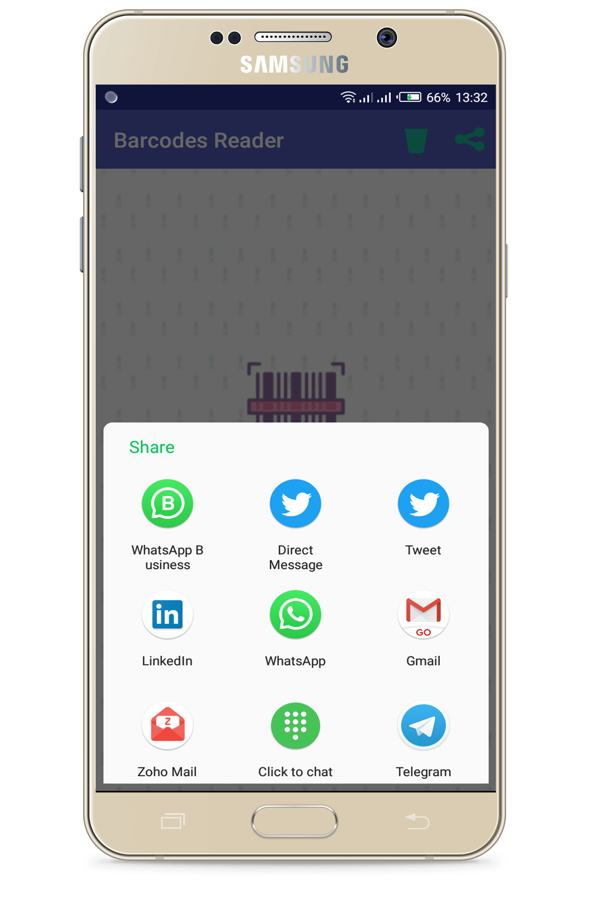

## Barcodes Reader in Xamarin.Forms

### Lioncoding article Link

[Barcodes Reader in Xamarin.Forms](https://lioncoding.com/2019/02/21/2019-02-21-concevoir-un-lecteur-de-code-barres-avec-xamarin-forms/)

### Nuget packages used

|                           Packages                           | Version |       Use for        |
| :----------------------------------------------------------: | :-----: | :------------------: |
|      [Autofac](https://www.nuget.org/packages/Autofac/)      |  4.9.1  | Inversion of control |
| [ZXing.Net.Mobile](https://www.nuget.org/packages/ZXing.Net.Mobile/) |  2.4.1  |  Scanning Barcodes   |
| [ZXing.Net.Mobile.Forms](https://www.nuget.org/packages/ZXing.Net.Mobile.Forms/) |  2.4.1  |  Scanning Barcodes   |
| [Xamarin.Essentials](https://www.nuget.org/packages/Xamarin.Essentials) |  1.0.1  | Sharing scan result  |

### Initializations and Configurations

##### Android project

- MainActivity.cs

```c#
protected override void OnCreate(Bundle savedInstanceState)
{
    // ...
	ZXing.Net.Mobile.Forms.Android.Platform.Init();
	Xamarin.Essentials.Platform.Init(this, savedInstanceState);
    // ...
}

public override void OnRequestPermissionsResult(int requestCode, string[] permissions, [GeneratedEnum] Android.Content.PM.Permission[] grantResults)
{
    global::ZXing.Net.Mobile.Android.PermissionsHandler.OnRequestPermissionsResult(requestCode, permissions, grantResults);
    Xamarin.Essentials.Platform.OnRequestPermissionsResult(requestCode, permissions, grantResults);
    base.OnRequestPermissionsResult(requestCode, permissions, grantResults);
}
```

- AssemblyInfo.cs (Add permissions for scanning)

```c#
[assembly: UsesPermission(Android.Manifest.Permission.Flashlight)]
[assembly: UsesPermission(Android.Manifest.Permission.Camera)]
```

##### IOS project

- AppDelegate.cs

```c#
public override bool FinishedLaunching(UIApplication app, NSDictionary options)
{
	// ...
	ZXing.Net.Mobile.Forms.iOS.Platform.Init();
	// ...
}
```

### View source code

```xml
<?xml version="1.0" encoding="utf-8" ?>
<ContentPage
    x:Class="BarCodeReader.Views.MainMenuView"
    xmlns="http://xamarin.com/schemas/2014/forms"
    xmlns:x="http://schemas.microsoft.com/winfx/2009/xaml"
    Title="{Binding Title}"
    BackgroundImage="bg.jpg">


    <ContentPage.ToolbarItems>
        <ToolbarItem
            Command="{Binding ClearResultCommand}"
            Icon="clear.png"
            Text="Clear" />
        <ToolbarItem
            Command="{Binding ShareResultCommand}"
            Icon="share.png"
            Text="Share" />
    </ContentPage.ToolbarItems>


    <ContentPage.Content>
        <StackLayout HorizontalOptions="CenterAndExpand" VerticalOptions="CenterAndExpand">
            <ImageButton
                Aspect="AspectFit"
                BackgroundColor="Transparent"
                Command="{Binding ScanCommand}"
                FlexLayout.AlignSelf="Center"
                FlexLayout.Grow="1"
                HorizontalOptions="CenterAndExpand"
                Source="barcodescanner.png"
                VerticalOptions="CenterAndExpand">
                <VisualStateManager.VisualStateGroups>
                    <VisualStateGroup x:Name="CommonStates">
                        <VisualState x:Name="Normal">
                            <VisualState.Setters>
                                <Setter Property="Scale" Value="1" />
                            </VisualState.Setters>
                        </VisualState>

                        <VisualState x:Name="Pressed">
                            <VisualState.Setters>
                                <Setter Property="Scale" Value="0.8" />
                            </VisualState.Setters>
                        </VisualState>

                    </VisualStateGroup>
                </VisualStateManager.VisualStateGroups>
            </ImageButton>
            <Label
                Margin="10,20,10,0"
                FontAttributes="Bold"
                FontSize="18"
                HorizontalOptions="CenterAndExpand"
                HorizontalTextAlignment="Center"
                Text="{Binding ScanResult}"
                TextColor="#525ABB"
                VerticalOptions="CenterAndExpand" />
        </StackLayout>
    </ContentPage.Content>

</ContentPage>
```

### Code behind

```c#
using BarCodeReader.ViewModels;

using Xamarin.Forms;
using Xamarin.Forms.Xaml;

namespace BarCodeReader.Views
{
    [XamlCompilation(XamlCompilationOptions.Compile)]
    public partial class MainMenuView : ContentPage
    {
        private MainMenuViewModel viewModel;
        public MainMenuView()
        {
            InitializeComponent();
            BindingContext = viewModel = new MainMenuViewModel();
            RegisterMesssages();
        }

        private void RegisterMesssages()
        {
            MessagingCenter.Subscribe<MainMenuViewModel>(this, "NoScanResultToClear", (m) =>
            {
                if (m != null)
                {
                    DisplayAlert("Warning !", "No scan result to clear.", "OK");
                }
            });

            MessagingCenter.Subscribe<MainMenuViewModel>(this, "NoScanResultToShare", (m) =>
            {
                if (m != null)
                {
                    DisplayAlert("Warning !", "No scan result to share.", "OK");
                }
            });
        }
    }
}
```

### View Model code

```c#
using System.Threading.Tasks;
using System.Windows.Input;
using Xamarin.Essentials;
using Xamarin.Forms;
using ZXing.Net.Mobile.Forms;

namespace BarCodeReader.ViewModels
{
    public class MainMenuViewModel : BaseViewModel
    {
        public MainMenuViewModel()
        {
            Title = "Barcode Reader";
            ScanCommand = new Command(async () => await Scannning());
            ClearResultCommand = new Command(ClearResult);
            ShareResultCommand = new Command(async () => await ShareResult());
        }


        private async Task ShareText(string text)
        {
            await Share.RequestAsync(new ShareTextRequest
            {
                Text = text,
                Title = "Share"
            });
        }


        // Share Scan result
        private async Task ShareResult()
        {
            if (string.IsNullOrEmpty(ScanResult))
            {
                MessagingCenter.Send(this, "NoScanResultToShare");
            }
            else
            {
                await ShareText(ScanResult);
            }
        }


        // Clear Scan result
        private void ClearResult()
        {
            if (string.IsNullOrEmpty(ScanResult))
            {
                MessagingCenter.Send(this, "NoScanResultToClear");
            }
            else
            {
                ScanResult = "";
            }
        }


        // Do scanning
        private async Task Scannning()
        {
            var scanPage = new ZXingScannerPage
            {
                Title = "Scanning...",
                BackgroundColor = Color.FromHex("#212223")
            };
            await App.Current.MainPage.Navigation.PushAsync(scanPage);
            scanPage.OnScanResult += (result) =>
            {
                // Stop scanning
                scanPage.IsScanning = false;

                // Pop to page and show the result
                Device.BeginInvokeOnMainThread(async () =>
                {
                    await App.Current.MainPage.Navigation.PopAsync();
                    ScanResult = result?.Text;
                });
            };
        }

        public ICommand ScanCommand { get; private set; }
        public ICommand ClearResultCommand { get; private set; }
        public ICommand ShareResultCommand { get; private set; }

        private string _scanResult;
        public string ScanResult
        {
            get { return _scanResult; }
            set { SetProperty(ref _scanResult, value); }
        }
    }   
}

```

### Screenshots







